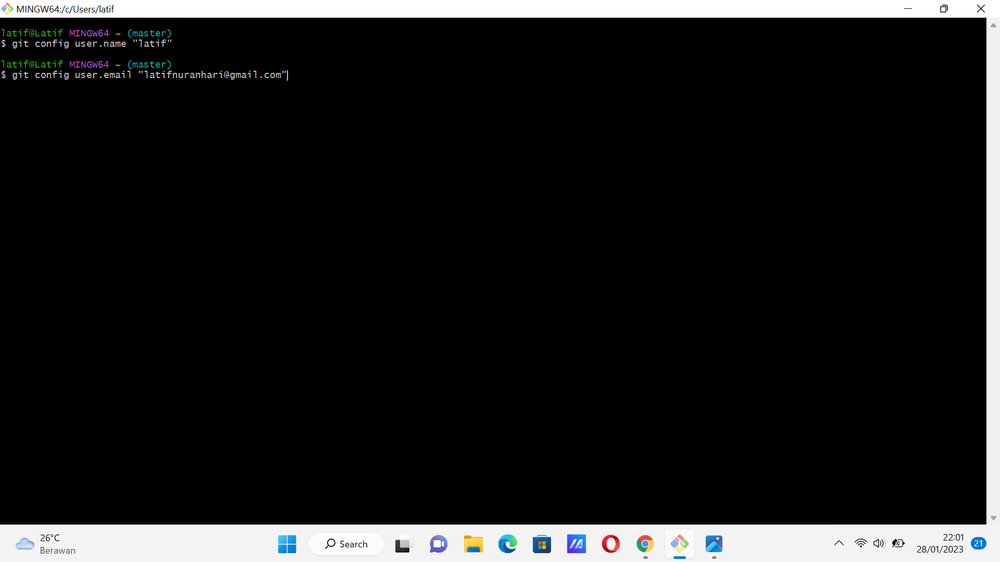
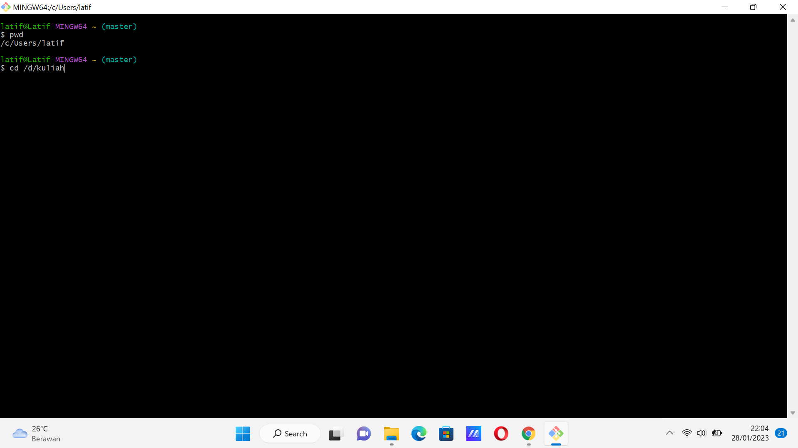
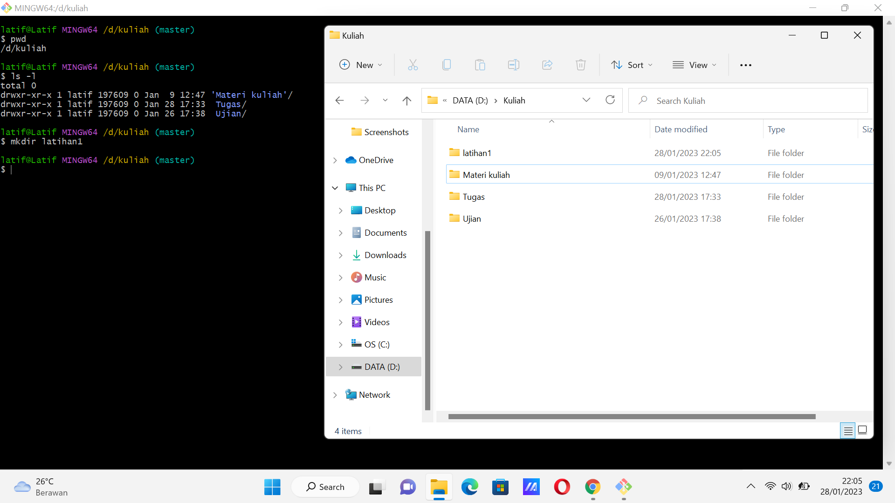
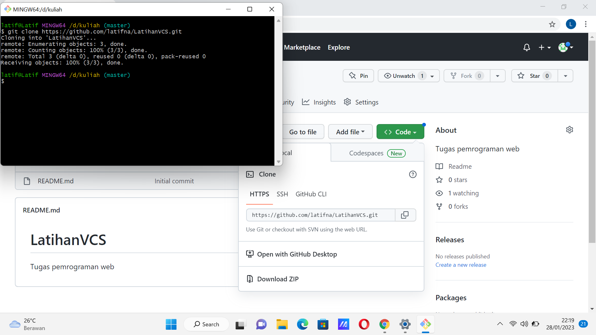
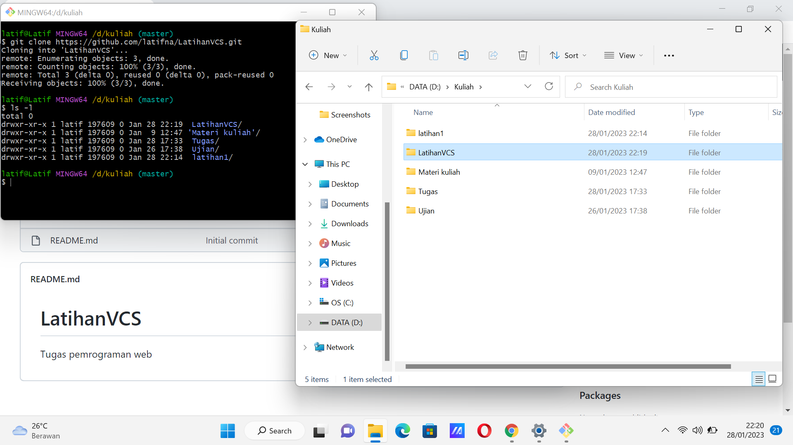
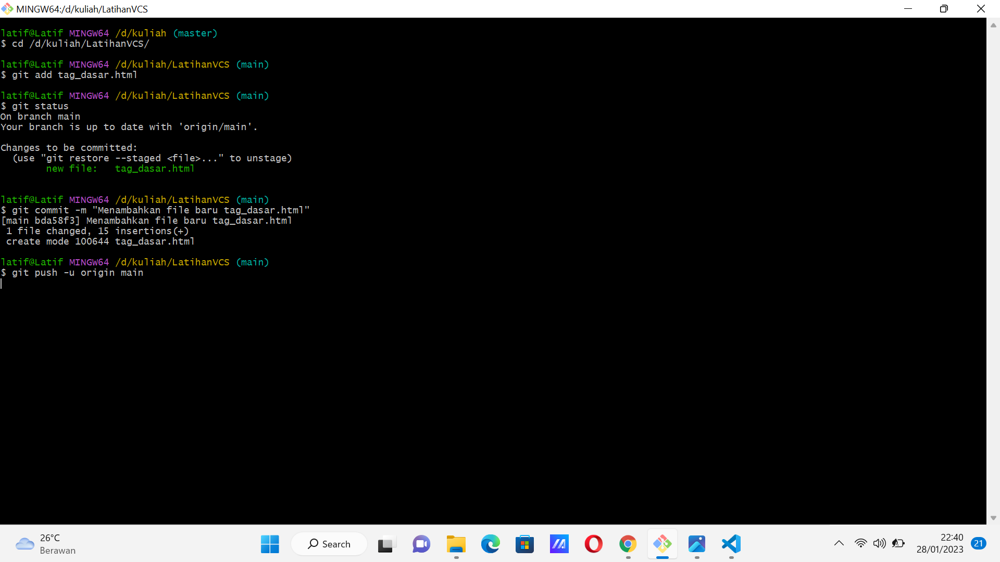
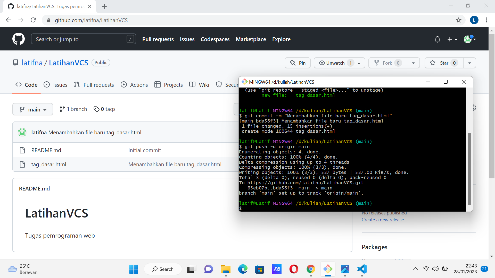
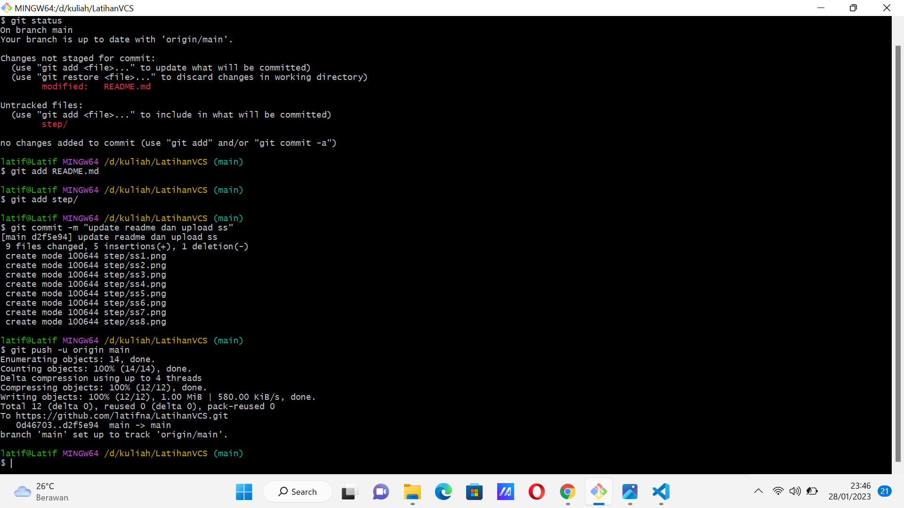

# LatihanVCS
## Tugas bahasa pemrograman

### Dasar - dasar penggunaan git

1. Pada saat pertama kali menggunakan git, perlu dilakukan konfigurasi user.name dan user.email agar tidak terjadi kegagalan saat menjalankan perintah git commit

2. Perintah 'cd' digunakan untuk masuk ke directory penyimpanan

3. Perintah 'mkdir/git init' digunakan untuk membuat repository local

4. Perintah 'echo"#isi file" >> README.md' digunakan untuk membuat file README.md

### Cara membuat atau menambahkan file ke repository server

1. Buat akun terlebih dahulu di https://github.com
2. Lalu klik new repository
3. Isi nama repositiry dan klik create repository
4. Perintah 'git clone[url]' digunakan untuk membuat working directory yang diambil dari reposity server
 
5. Langkah - langkah untuk menambahkan file ke dalam repository server 
    1. lakukan perintah 'cd' untuk masuk ke repository utama
    2. 'git add namafile.html' perintah untuk menambahkan file baru
    3. 'git status' perintah untuk melihat status file terbaru
    4. 'git commit -m "komentar"' perintah untuk menyimpan perubahan kedalam database git
    5. 'git push u- origin main' perintah untuk mengirim perubahan pada repository local menuju repository server 
6. Lakukan hal yang sama ( step no 5) untuk update saat terjadi perubahan file pada repository server 